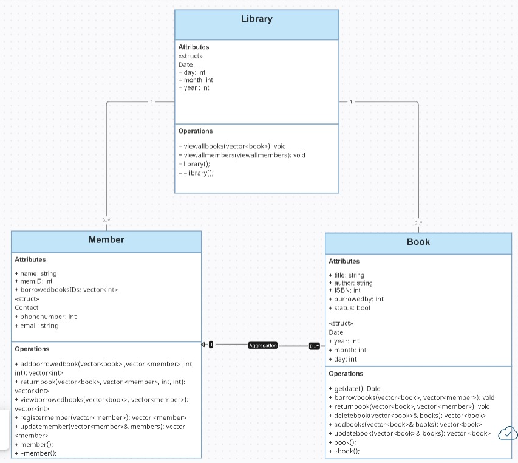

# Library Management System (LMS) - Project Overview

## Purpose and Concept:

The LMS is designed to automate the management of books and members in a library. The software will facilitate:

- Librarians in tracking and managing books.
- Members in borrowing and returning books efficiently.

This project also serves as an introduction to core Object-Oriented Programming (OOP) principles such as **encapsulation**, **inheritance**, and **abstraction**.

## Main Features:

### 1. Book Management:

- **Add Books**: Create new entries with title, author, ISBN, and publication date.
- **Update Books**: Modify details or update availability status.
- **Delete Books**: Remove books when no longer needed.

### 2. Member Management:

- **Register Members**: Add members with name, ID, and contact information.
- **Update Member Information**: Edit member details and status.
- **Track Borrowing History**: Maintain a record of borrowed books, due dates, and fines.

### 3. Borrowing and Returning Books:

- **Borrow Books**: Update book status to "checked out" and record the borrowing date.
- **Return Books**: Update book status to "available" and calculate overdue fines if necessary.

---

## UML Class Diagram Elements:

### Classes:

- `Book`: Attributes include `title`, `author`, `ISBN`, `publication date`, and `status` (available/checked out).
- `Member`: Attributes include `name`, `membership ID`, `contact information`, and `borrowed books`.
- `Library`: Methods include `addBook()`, `removeBook()`, `registerMember()`, `borrowBook()`, and `returnBook()`.

### Relationships:

- **Association**: The `Library` class has a one-to-many relationship with both `Book` and `Member`.
- **Aggregation**: A `Member` can have multiple borrowed `Books`.

---

## UML Class Diagram:

## How to run the project

- **in the terminal write** `g++ main.cpp -o main`
- **to genrate** `./main`

